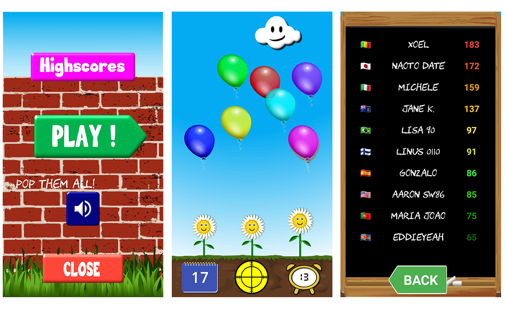
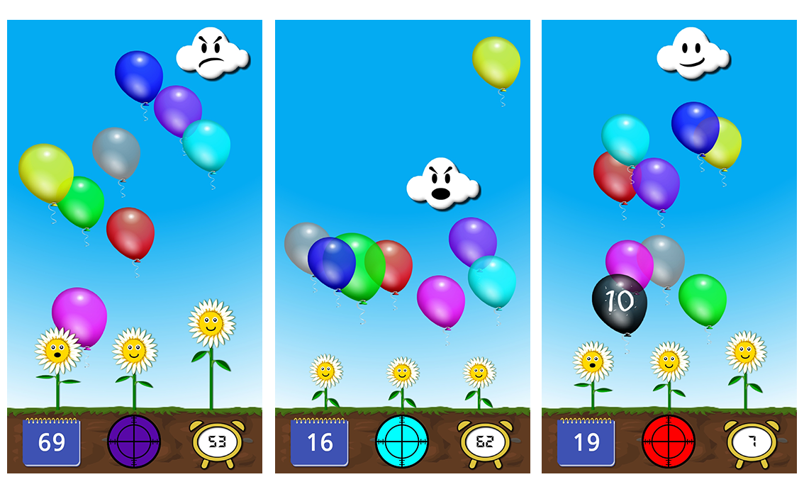

# Pop them all

 
 

This is a colorful and easy-going game for Android. You have to **pop the balloon** corresponding to the color you see in the viewfinder.  

Each game starts with a **60 second** countdown timer.
If you pop the right balloon you earn 1 point and 1 second. If you pop the wrong balloon you lose 2 points and 2 seconds. 
Once the timer reaches 0, the game is over.

 

  

 

Further gameplay features are:

- Once a balloon falls to the ground and bounces on one of the **3 smiley flowers**, it will inflate a bit. After several inflates, the balloon will blow up, making you lose 2 points and 2 seconds of time. The flowers are small at the beginning, but they will **grow in size** as the time passes, taking up more and more screen space and making the game progressively harder.

- The **lovely little cloud** you see up in the sky is a bit of a quirky character: she doesn’t love to get hit by the balloons and will push them away. Also, from time to time, the cloud will get really upset and will venture down from the sky to furiously **shove the balloons** to the ground. During those chaotic times, it will be especially hard to pop the right balloon while avoiding the others.

- Sometimes, a **black balloon** will randomly appear between the other balloons. The black balloon has a countdown clock with seconds marked on it, starting at 10. Pop the black balloon as fast as you can, and you will earn the number of **seconds marked on it**.

 

  

 

You can also download the app by scanning the QR code below:

 

  

  
 